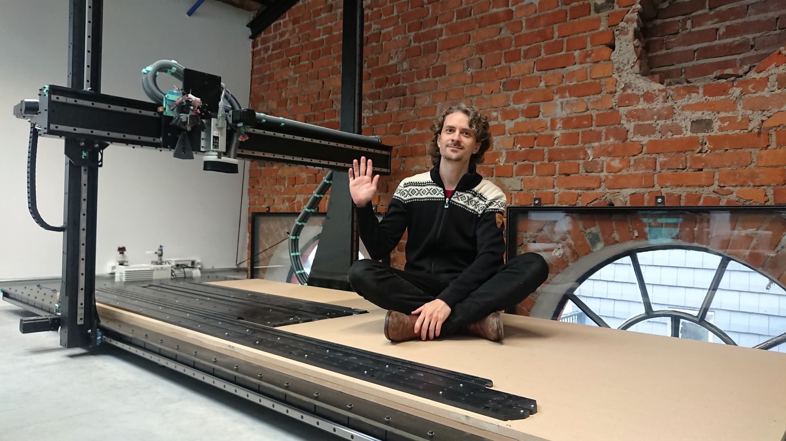
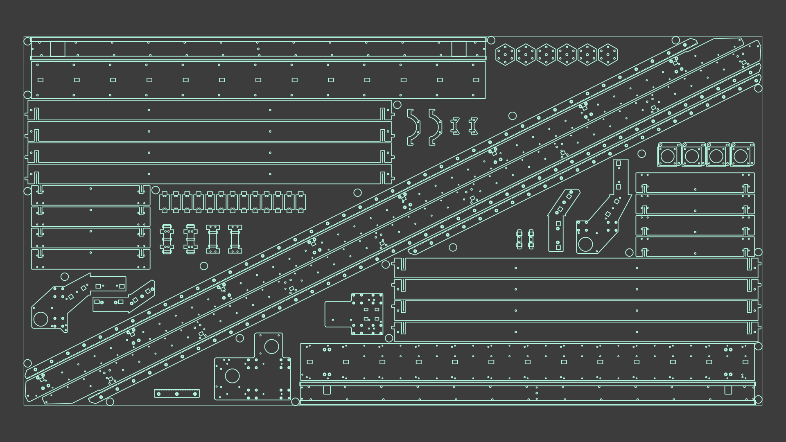
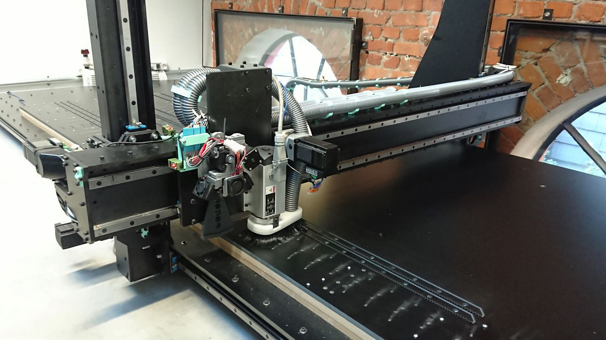
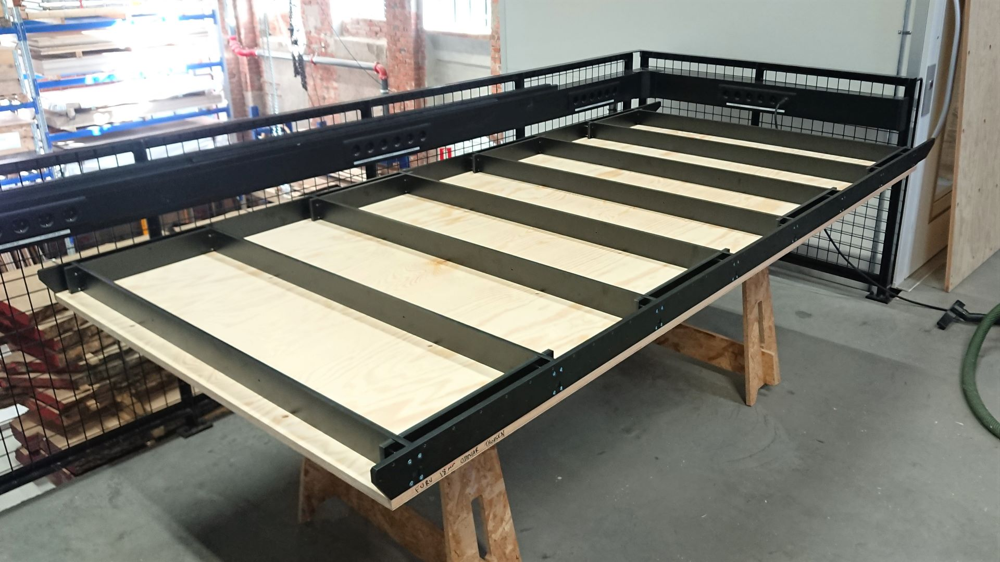
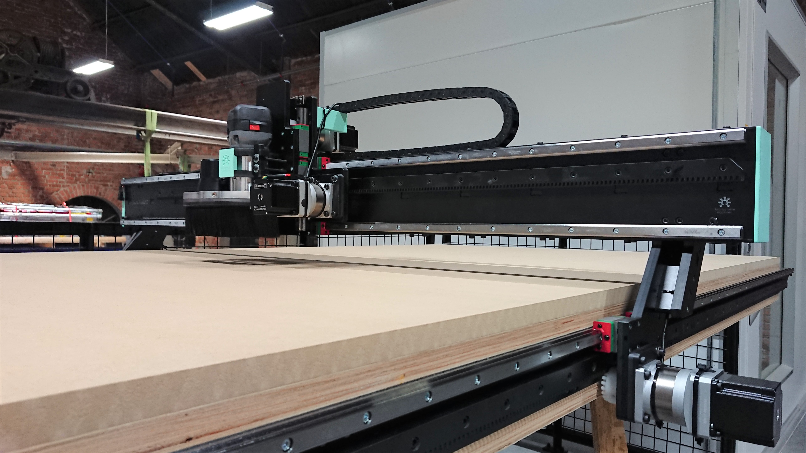

### Slide1

 - [Hanzo](https://github.com/Fabricatable-Machines/Hanzo) research platform
 - Combined 3D printer and CNC mill
 - For research experiments in sustainable manufacturing and automation
 
 ### Slide2

 - Cutsheet of [Humphrey2](https://github.com/Fabricatable-Machines/Humphrey2), a self replicating CNC router
 - All structural parts fit on a single cutsheet of 12mm phenolic resin cardboard composite
 
 ### Slide3

 - Making the first version of Humphrey2 on Hanzo
 - Fab made machines are making new machines
 
 ### Slide4

 - Assembly snapshot of Humphrey2
 
 ### Slide5

 - Humphrey2 ready for use
 - About 85% of parts are fabriacatble

